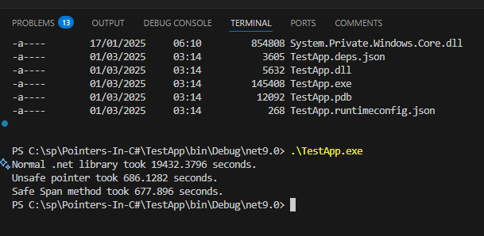

Testing conversion of a giant image, using three methods in C# .net, Normal image library, unsafe code using pointer and using Span object.

 - Normal .net library took 19432.3796 seconds.
 - Unsafe pointer took 686.1282 seconds.
 - Safe Span method took 677.896 seconds.

