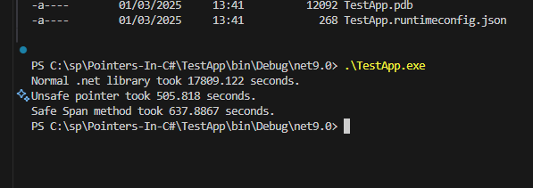

Testing conversion of a giant image, using three methods in C# .net, Normal image library, unsafe code using pointer and using Span object.

 - Normal .net library took 17809.122 seconds.
 - Unsafe pointer took 505.818 seconds.
 - Safe Span method took 637.8867 seconds.

